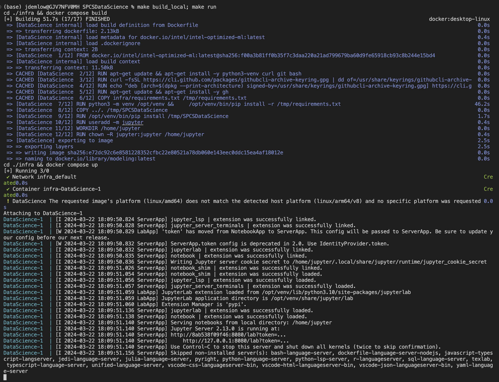
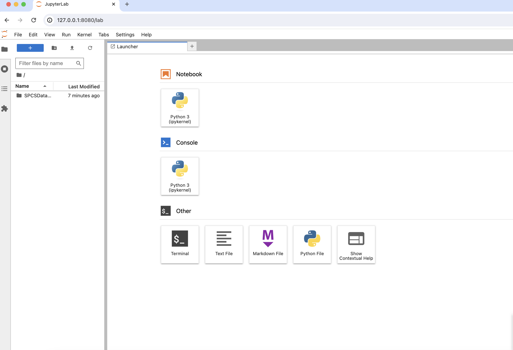
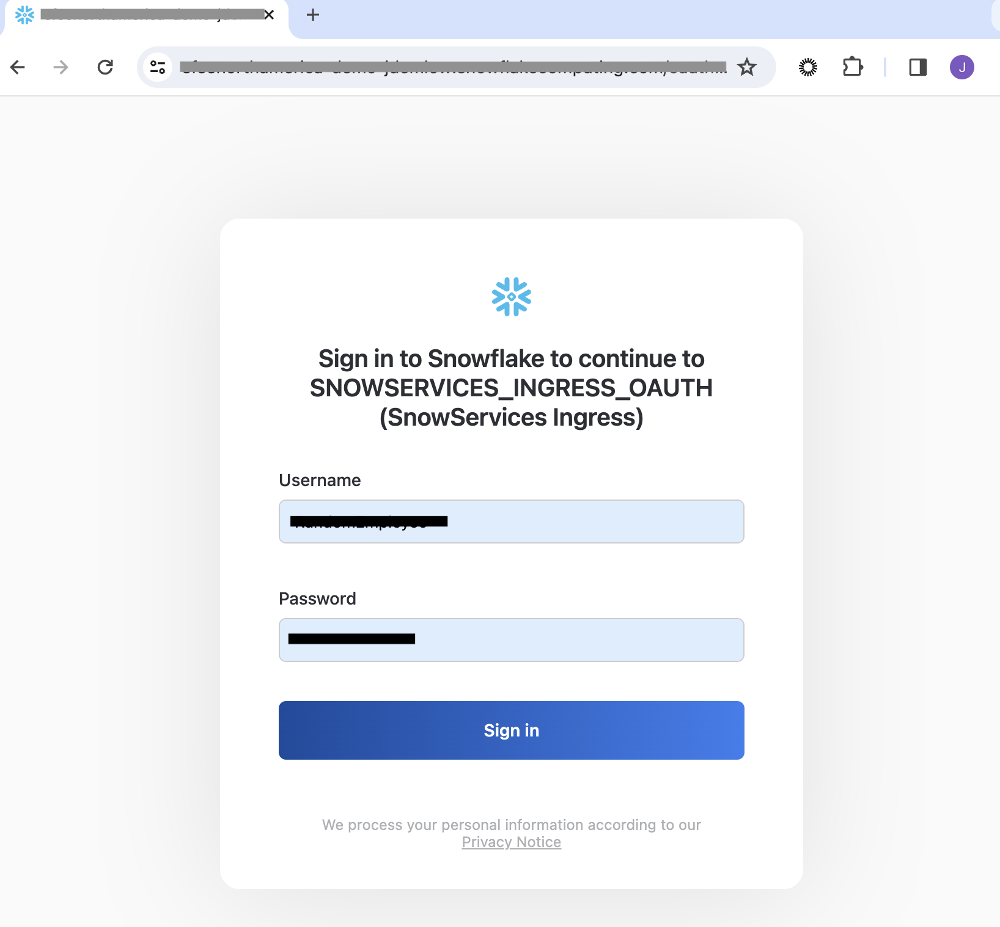
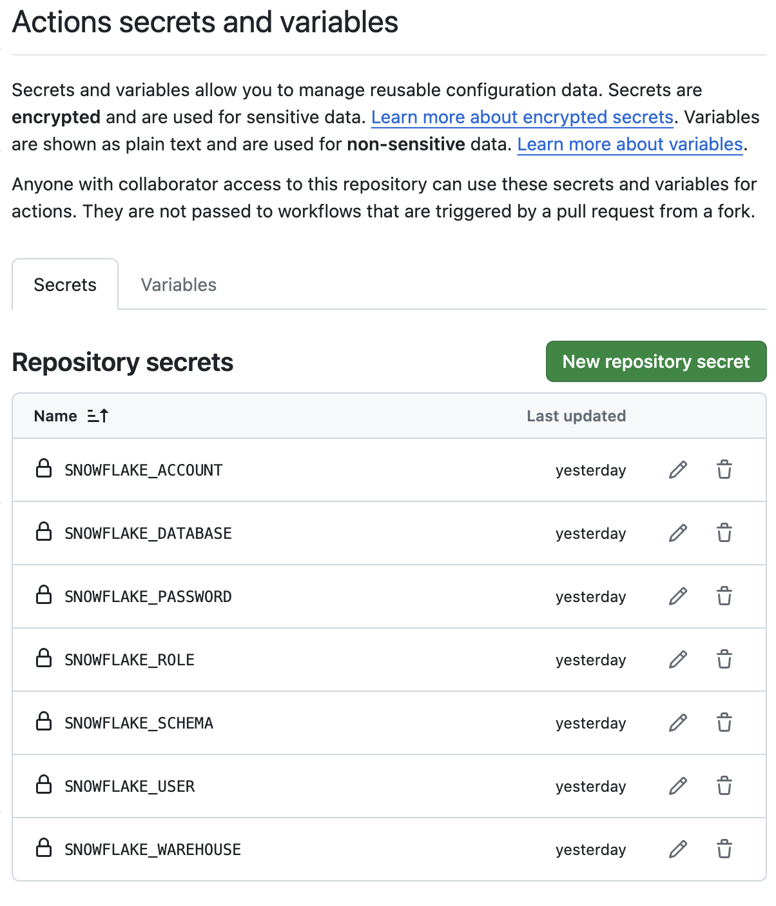
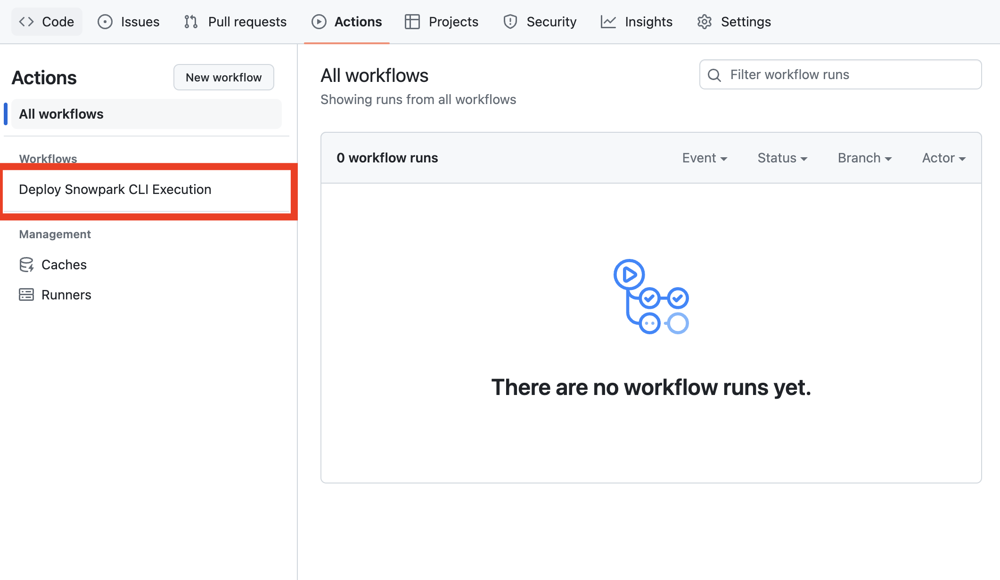
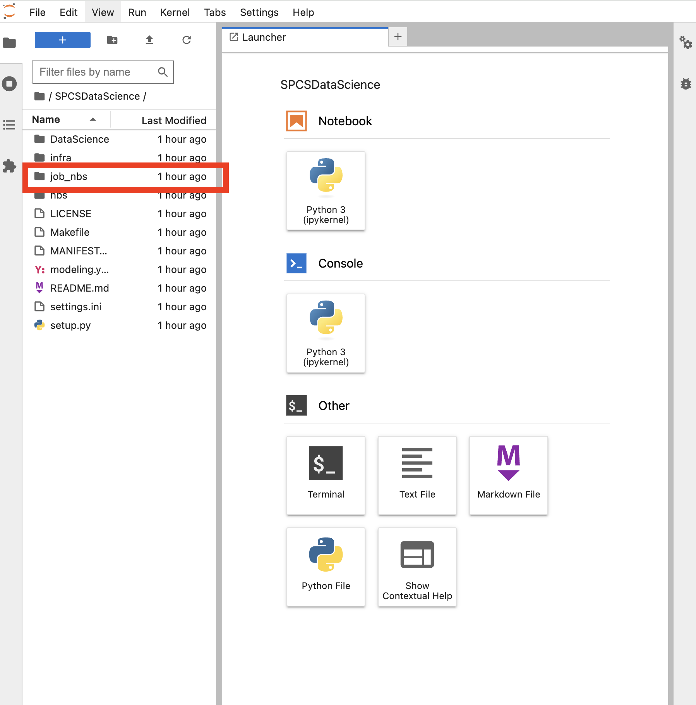
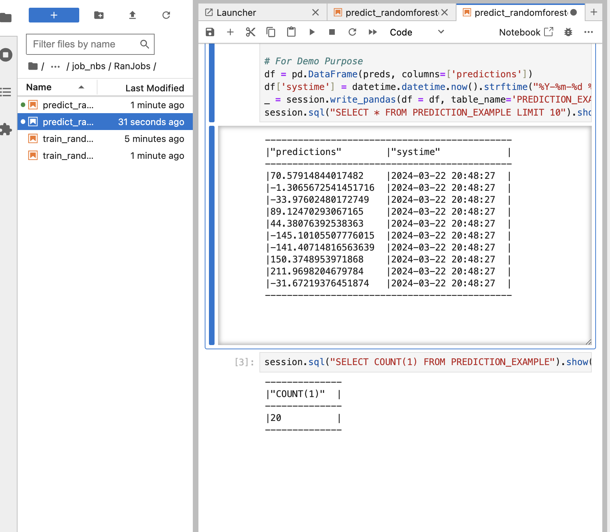

# DataScience Development Snowpark Container Services


<!-- WARNING: THIS FILE WAS AUTOGENERATED! DO NOT EDIT! -->

> WARNING: This is intended for development purposes only and has not
> been approved by security or infosec for deployment. If you plan to
> deploy this, be aware of the risks, as it has not been fully secured.
> Please consult with your data governance teams to ensure safe
> deployment.

Why? As an 8+ year data scientist and machine learning engineer, this is
what we have always wanted to be able to do in Snowflake, and now SPCS
makes it possible. We are adopting a Jupyter notebook-first approach to
development, inspired by the practices of Fast.ai and the great work of
nbdev. Jeremy Howard has been an incredible mentor to many in the
open-source community, and I want to acknowledge his contributions here.
While you may prefer different development tools, this initial setup is
optimized for Jupyter Lab but is adaptable to accommodate R Studio,
Scala, or any other environment that suits your development style.

## Create Local Conda EnvironmXent

> **Warning**: You must have Conda installed on your computer already
> before you can proceed with this process.

``` python
! conda create --name snowpark --override-channels -c https://repo.anaconda.com/pkgs/snowflake python=3.10 --y; conda activate snowpark; pip install -r ../infra/requirements.txt
```

Once installed, you will want to switch your kernel to `snowpark`. You
might need to close Jupyter and reopen it to switch to the correct
environment.

## Creating a Symlink

``` python
# Create Symlink for Notebook
! ln -s ../DataScience/ ./DataScience
```

## Load Libraries Needed

``` python
from DataScience.connection import *

import os
import pandas as pd
```

## Create Session and Execute Set Up

> If you don’t have your enviornment variables set for this then you
> will want to change the next cell to the following cell

``` python
session = create_snowflake_session(
    database='Classification',
    schema='PROD',
    warehouse='ML_WH',
    role='ML_USER_ROLE',
    # role='ACCOUNTADMIN',
)
session.sql_simplifier_enabled = True
snowflake_environment = session.sql('SELECT current_user(), current_version()').collect()
snowpark_version = VERSION
print('\nConnection Established with the following parameters:')
print('User                        : {}'.format(snowflake_environment[0][0]))
print('Role                        : {}'.format(session.get_current_role()))
print('Database                    : {}'.format(session.get_current_database()))
print('Schema                      : {}'.format(session.get_current_schema()))
print('Warehouse                   : {}'.format(session.get_current_warehouse()))
print('Snowflake version           : {}'.format(snowflake_environment[0][1]))
print('Snowpark for Python version : {}.{}.{}'.format(snowpark_version[0],snowpark_version[1],snowpark_version[2]))
```

``` python
execute_sql_file(
    session,
    file_path='DataScience/files/sql/00_setup.sql'
)
```


We want to make We want to ensure our image repository was created, so
we will run the following command: out image repository was created so
we will run the following command

``` python
# Removing 'repository_url' column from output to secure the URL link
display(pd.DataFrame(session.sql(f"SHOW IMAGE REPOSITORIES;").collect())[['created_on', 'name', 'database_name', 'schema_name', 'owner', 'owner_role_type', 'comment', 'repository_url']])
pd.DataFrame(session.sql(f"SHOW IMAGE REPOSITORIES;").collect())[['repository_url']].values[0][0]
```

^^string above is going to be your repository that you will put into the
cells below to make your make file.

> [!NOTE]
>
> ### Explain Setup Execution Code
>
> # Snowflake Setup for Container Usage
>
> This documentation outlines the steps to configure Snowflake for
> container usage, emphasizing on roles, warehouses, databases, and
> stages setup, specifically tailored for modeling and development
> purposes.
>
> ## Step 1: Create a Role with Required Privileges
>
> First, we initiate the process by switching to the `ACCOUNTADMIN` role
> to create a new role named `CONTAINER_USER_ROLE`. This role is then
> granted a set of privileges that are essential for the management and
> operation of databases, warehouses, and integrations within Snowflake.
> These privileges are crucial for creating and managing the
> infrastructure needed for containerized applications.
>
> ``` sql
> USE ROLE ACCOUNTADMIN;
> CREATE ROLE CONTAINER_USER_ROLE;
> GRANT CREATE DATABASE ON ACCOUNT TO ROLE CONTAINER_USER_ROLE;
> GRANT CREATE WAREHOUSE ON ACCOUNT TO ROLE CONTAINER_USER_ROLE;
> GRANT CREATE COMPUTE POOL ON ACCOUNT TO ROLE CONTAINER_USER_ROLE;
> GRANT CREATE INTEGRATION ON ACCOUNT TO ROLE CONTAINER_USER_ROLE;
> GRANT MONITOR USAGE ON ACCOUNT TO ROLE CONTAINER_USER_ROLE;
> GRANT BIND SERVICE ENDPOINT ON ACCOUNT TO ROLE CONTAINER_USER_ROLE;
> GRANT IMPORTED PRIVILEGES ON DATABASE snowflake TO ROLE CONTAINER_USER_ROLE;
> ```
>
> ## Step 2: Grant the New Role to `ACCOUNTADMIN`
>
> After creating the `CONTAINER_USER_ROLE`, it’s necessary to grant this
> role to the `ACCOUNTADMIN` to ensure the administrator can utilize
> this new role. This step integrates the newly created role within the
> organizational roles hierarchy, allowing for seamless role management
> and access control.
>
> ``` sql
> GRANT ROLE CONTAINER_USER_ROLE TO ROLE ACCOUNTADMIN;
> ```
>
> ## Step 3: Create and Configure a Warehouse
>
> Next, we focus on setting up a warehouse named `CONTAINER_DEMO_WH`
> with specified parameters to support the operational needs of
> container usage. This includes defining the warehouse size,
> auto-suspend, and auto-resume settings to optimize resource
> utilization.
>
> ``` sql
> CREATE OR REPLACE WAREHOUSE CONTAINER_DEMO_WH
> WAREHOUSE_SIZE = XSMALL
> AUTO_SUSPEND = 120
> AUTO_RESUME = TRUE;
> GRANT OWNERSHIP ON WAREHOUSE CONTAINER_DEMO_WH TO ROLE CONTAINER_USER_ROLE REVOKE CURRENT GRANTS;
> ```
>
> ## Step 4: Setup Database and Stages
>
> With the `CONTAINER_USER_ROLE`, we proceed to create a database
> `CONTAINER_DEMO_DB` and configure stages for different purposes,
> including specs, volumes, and RDF models. Each stage is set up with
> encryption and directory enablement, tailored for specific use cases
> such as storing Docker image commands, data development, and modeling
> purposes.
>
> ``` sql
> USE ROLE CONTAINER_USER_ROLE;
> CREATE OR REPLACE DATABASE CONTAINER_DEMO_DB;
> USE DATABASE CONTAINER_DEMO_DB;
>
> CREATE STAGE IF NOT EXISTS SPECS
> ENCRYPTION = (TYPE='SNOWFLAKE_SSE')
> DIRECTORY = (ENABLE = TRUE)
> COMMENT = 'Store Docker Image Commands for SPECS';
>
> CREATE STAGE IF NOT EXISTS VOLUMES
> ENCRYPTION = (TYPE='SNOWFLAKE_SSE')
> DIRECTORY = (ENABLE = TRUE)
> COMMENT = 'Saving Data As We Develop In Snowflake';
>
> CREATE STAGE IF NOT EXISTS RDF_MODEL
> ENCRYPTION = (TYPE='SNOWFLAKE_SSE')
> DIRECTORY = (ENABLE = TRUE)
> COMMENT = 'For This Use Case';
> ```
>
> ## Step 5: Create and Configure Image Repository
>
> Finally, an image repository named `IMAGE_REPO` is created within the
> `CONTAINER_DEMO_DB.PUBLIC` schema for modeling usage. This repository
> is essential for managing container images, facilitating the
> development and deployment process. Access rights are granted to the
> `CONTAINER_USER_ROLE` for both reading and writing, ensuring the role
> can fully utilize the repository for container management.
>
> ``` sql
> CREATE IMAGE REPOSITORY CONTAINER_DEMO_DB.PUBLIC.IMAGE_REPO
> COMMENT = 'This is for modeling usage';
>
> GRANT READ ON STAGE CONTAINER_DEMO_DB.PUBLIC.RDF_MODEL TO ROLE CONTAINER_USER_ROLE;
> GRANT WRITE ON STAGE CONTAINER_DEMO_DB.PUBLIC.RDF_MODEL TO ROLE CONTAINER_USER_ROLE;
>
> GRANT READ ON IMAGE REPOSITORY CONTAINER_DEMO_DB.PUBLIC.IMAGE_REPO TO ROLE CONTAINER_USER_ROLE;
> GRANT WRITE ON IMAGE REPOSITORY CONTAINER_DEMO_DB.PUBLIC.IMAGE_REPO TO ROLE CONTAINER_USER_ROLE;
> ```

## Configure Yaml Files

> **Warning**: Set up config.toml with snow sql need to be set up before
> running configure.sh and ensure Docker is on your computer

``` python
# The last output of this will be the url you put here
! rm ../modeling.yaml
! rm ../Makefile
! bash ../infra/configure.sh -r "sfsenorthamerica-demo-jdemlow.registry.snowflakecomputing.com/container_demo_db/public/image_repo" -w "CONTAINER_DEMO_WH" -i "modeling"
```

``` python
! cat ../modeling.yaml
```

#### Move Newly Created Spec File (modeling.yaml) to Stage @specs

``` python
stage_location = r'@specs'
stage_location = stage_location.strip('@')
file_path = '../modeling.yaml'

put_results = session.file.put(local_file_name=file_path, stage_location=stage_location, auto_compress=False, overwrite=True)
for result in put_results:
    print(f"File: {result.source}, Status: {result.status}")
display(pd.DataFrame(session.sql('ls @specs').collect()))
```

### Docker Creation

#### Run Docker Build Locally

> We want you to test this locally by designed to allow you to have a
> better understanding `make build_local; make run` and make sure it’s
> working as you would expect it then move on to the next steps.

1.  Download docker desktop and ensure it is open and running.

    - **Warning**: Make sure you have docker running and make sure you
      > have logged in already `~/.docker/config.json` you can check
      > this or run docker login in the terminal

    - **Also make sure you make your .env file in infra** for your
      > enviornment vairiables to be used in your docker-compose.yaml.
      > As you grow out of this tutorial mode the next step here would
      > be to create github actions to create these approaches so that
      > you are able to run this in a more devops style approach. In
      > future versions this will be shown.

2.  Open Terminal navigate to this repo and run `make build_local`

    - If you are using VS code you can simple click terminal and paste
      the command

3.  After your local build is complete you can then run `make run`.

    - This is going to be running a docker compose process that can be
      viewed inside of the infra/ folder

#### Pictures of Steps







> **Note**: As SPCS will not allow your volumes to be respected in a two
> way methodology we have observed that COPY statements in your
> dockerfile which land in a directory which are then stage-mounted as a
> volume will NOT initialize the file in-stage. We have on open product
> gap for this but has thus far been low-priority currently so we are
> going to bring this repo to our development experience using the
> github, gitlab, bitbucket etc integrations later on in this process.
> So if you are wondering why we are using gh cli to bring the repo to
> the docker image this is one of the reasons.

> You also need to make sure you are able to login in with snowql and
> snow cli to be able to run the following commands

#### Pushing Image To Snowflake

> make all will –\> Login, Create, Push To Snowflake

``` python
! cd ../ &&  make all
```

> [!NOTE]
>
> ### Explain Make File Call
>
> The `make all` command in the context of a Makefile is a target that
> typically encompasses a series of dependent tasks required to build a
> project. It’s designed to automate the process of compiling, building,
> and preparing a software application or service. Here’s a step-by-step
> explanation of what `make all` does in the provided Makefile script:
>
> 1.  **`login:`** This target logs into the Snowflake Docker
>     repository. It’s the initial step to ensure that subsequent
>     operations, such as pushing a Docker image, can authenticate
>     against the Snowflake registry. The `docker login` command uses
>     the `$(SNOWFLAKE_REPO)` variable, which should contain the URL of
>     the Snowflake Docker repository.
>
> 2.  **`build:`** This target builds a Docker image for Snowpark
>     Container Services. It specifies the platform as `linux/amd64`,
>     uses a Dockerfile located in the `infra` directory, and tags the
>     resulting image with the name specified in the `$(DOCKER_IMAGE)`
>     variable. This step prepares the Docker image with the necessary
>     environment and dependencies for the application.
>
> 3.  **`push_docker:`** After the Docker image is built, this target
>     tags and pushes it to the Snowflake Container Services repository
>     specified in the `$(SNOWFLAKE_REPO)` variable. This makes the
>     Docker image available in Snowflake’s registry, allowing it to be
>     used in Snowflake Container Services.
>
> In summary, `make all` in this script is a composite command that
> automates the workflow of logging into the Snowflake Docker
> repository, building a Docker image tailored for Snowpark Container
> Services, and pushing the built image to the Snowflake repository.
> This streamlines the deployment process, ensuring that the Docker
> image is readily available in Snowflake for running services or
> applications.

``` python
execute_sql_file(
    session,
    file_path='DataScience/files/sql/01_container_services.sql'
)
```

> [!NOTE]
>
> ### Explain Container Services Execution Code
>
> # Snowflake Configuration for Enhanced Security and Services
>
> This documentation guides you through the process of configuring
> Snowflake for enhanced security measures and service creation,
> specifically tailored for modeling and development purposes within
> containerized environments.
>
> ## Step 1: Create Security Integration for OAuth
>
> The process begins with the creation of an OAuth security integration.
> This is a critical step for setting up authentication mechanisms,
> ensuring secure access to Snowflake services.
>
> ``` sql
> USE ROLE ACCOUNTADMIN;
> CREATE SECURITY INTEGRATION IF NOT EXISTS snowservices_ingress_oauth
>   TYPE=oauth
>   OAUTH_CLIENT=snowservices_ingress
>   ENABLED=true;
> ```
>
> ## Step 2: Configure Network Rules and External Access
>
> Following the security setup, network rules are defined to allow
> outbound traffic, facilitating external communications. An external
> access integration is also created to authorize this specified
> traffic, bolstering the security framework.
>
> ``` sql
> CREATE OR REPLACE NETWORK RULE ALLOW_ALL_RULE
>   TYPE = 'HOST_PORT'
>   MODE = 'EGRESS'
>   VALUE_LIST= ('0.0.0.0:443', '0.0.0.0:80');
>
> CREATE OR REPLACE EXTERNAL ACCESS INTEGRATION ALLOW_ALL_EAI
>   ALLOWED_NETWORK_RULES = (ALLOW_ALL_RULE)
>   ENABLED = true;
> ```
>
> ## Step 3: Grant Usage on Integrations
>
> Permissions are then granted to the `CONTAINER_USER_ROLE` for the
> external access integration, ensuring the role has the necessary
> access to utilize the integration for service communications.
>
> ``` sql
> GRANT USAGE ON INTEGRATION ALLOW_ALL_EAI TO ROLE CONTAINER_USER_ROLE;
> ```
>
> ## Step 4: Create and Modify Compute Pool
>
> A compute pool is established with specific node limits and an
> instance family, aligning with processing needs. This step also
> includes provisions for modifying the compute pool’s configuration to
> adjust resources as needed.
>
> ``` sql
> CREATE COMPUTE POOL IF NOT EXISTS CONTAINER_DEMO_POOL
>   MIN_NODES = 1
>   MAX_NODES = 2
>   INSTANCE_FAMILY = standard_1;
> GRANT USAGE ON COMPUTE POOL CONTAINER_DEMO_POOL TO ROLE CONTAINER_USER_ROLE;
> ```
>
> ## Step 5: Create Modeling Snowpark Service
>
> Next, a Snowpark service named `MODELING_SNOWPARK_SERVICE` is created
> using the specified compute pool. This service is designed for
> modeling purposes, incorporating external access integrations and
> specification details for optimal functionality.
>
> ``` sql
> USE ROLE CONTAINER_USER_ROLE;
> CREATE SERVICE CONTAINER_DEMO_DB.PUBLIC.MODELING_SNOWPARK_SERVICE
> in compute pool CONTAINER_DEMO_POOL
> from @SPECS
> specification_file='modeling.yaml'
> external_access_integrations = (ALLOW_ALL_EAI)
> MIN_INSTANCES=1
> MAX_INSTANCES=1;
> ```
>
> ## Step 6: User Creation and Role Assignment
>
> Finally, a user is created with specified credentials, default role,
> and warehouse settings. The `CONTAINER_USER_ROLE` is granted to the
> user, along with usage permissions on various resources to ensure
> comprehensive access and operational capabilities.
>
> ``` sql
> USE ROLE ACCOUNTADMIN;
> CREATE OR REPLACE USER RANDOMEMPLOYEE
> IDENTIFIED BY 'Snowflake2024'
> DEFAULT_ROLE = 'CONTAINER_USER_ROLE'
> DEFAULT_WAREHOUSE = 'CONTAINER_DEMO_WH';
> GRANT ROLE CONTAINER_USER_ROLE TO USER RANDOMEMPLOYEE;
> GRANT USAGE ON WAREHOUSE CONTAINER_DEMO_WH TO ROLE CONTAINER_USER_ROLE;
> GRANT USAGE ON SERVICE CONTAINER_DEMO_DB.PUBLIC.MODELING_SNOWPARK_SERVICE TO ROLE CONTAINER_USER_ROLE;
> ```

## Looking Into Service Created

``` python
session.sql("SHOW SERVICES;").show()
```

**Remember**: That this will take a few minutes of your service to be up
and running so you will be able run the following command again and it
will give you the url link that will allow you to log into your app with
the correct Username and Password.

> `CALL SYSTEM$GET_SERVICE_STATUS('CONTAINER_DEMO_DB.PUBLIC.MODELING_SNOWPARK_SERVICE');`
> You can also try this command to see the status of your service you
> might get an ingress_url before the pending state is resolved.

``` python
temp = pd.DataFrame(session.sql("SHOW ENDPOINTS IN SERVICE MODELING_SNOWPARK_SERVICE;").collect())
display(temp)
print(temp["ingress_url"].values[0])
```

Assuming ingest_url contains the URL you want to copy and paste this URL
into your browser and enjoy your modeling jupyter notebook.

1.  Open in web broswer and paste the ingress_url
2.  This will open a login page for this demo it is
    - Usename: RandomEmployee
    - Password: Snowflake2024
3.  Development App Will Load and Your Application is ready to go

# Snowflake Application Deployment

## Overview

This guide will walk you through the process of deploying a Snowflake
application, cloning a repository, setting up GitHub secrets, triggering
a GitHub Actions workflow, and exploring the resulting models and
predictions stored in Snowflake.

### Prerequisites

Before you begin, ensure that you have the following: - Docker installed
and configured on your local machine - A GitHub account with a
repository set up for your project - Access to a Snowflake instance with
the necessary permissions

## Getting Started

With the Docker image now deployed and ready, we are poised to explore
the capabilities of our newly created application. Navigate to a website
with a URL ending in `.snowflakecomputing.app` to begin.



Upon reaching the site, log in using the credentials for
“RandomEmployee”. This process grants access to your development
ecosystem.

> **Warning**: Allow 5-10 minutes for the application to become fully
> operational. Initial errors can often be resolved by refreshing the
> page or attempting to log in again after a brief wait.

The next step involves using a secure token found within your Docker
Image. If unchanged, the default token “my_secure_token” enhances
application security, although its use is optional.


Post-login, you may notice the development ecosystem appears empty. This
is due to the absence of a cloned repository. Although it may seem
unconventional, cloning a repo into the development application
addresses a known product gap, set for future resolution. Additionally,
integration with Git in PrPr is forthcoming, offering a more streamlined
experience with repositories.


Having cloned your repository, feel free to start development. Remember
to push changes back to your Git repository to remain updated with the
latest revisions. Your code is safely stored in a designated volume,
accessible via `ls @volumes/jupyter-nbs/` in Snowflake, complying with
specified requirements.

## GitHub Integration

To integrate your project with GitHub and enable automated workflows,
follow these steps:

1.  **Set up GitHub Secrets**: Ensure your GitHub repository contains
    the necessary secrets for authentication and access to your
    Snowflake instance. The setup should resemble the image below.

    

    Refer to the [GitHub Secrets
    documentation](https://docs.github.com/en/actions/security-guides/encrypted-secrets)
    for detailed instructions on how to create and manage secrets for
    your repository.

2.  **Configure GitHub Actions**: With GitHub secrets in place, navigate
    to your repository’s GitHub Actions to trigger the workflow.

    

3.  **Trigger the Workflow**: Manually trigger the workflow by selecting
    the appropriate action and providing any necessary inputs.

    

    Successfully triggering the workflow culminates in the construction
    of a RandomForestRegressor. This model, once trained, is utilized
    for predictions, subsequently recorded back into Snowflake. Future
    tutorials will delve into more sophisticated workflows, enhancing
    your data science projects within Snowflake.

> **Caution**: This tutorial does not encompass the entirety of a data
> science project’s requirements. It serves as an introductory guide,
> with plans to expand on Snowflake’s native ML capabilities, Cortex,
> and other projects. Stay tuned for updates and explore different
> branches for additional developments.

## Exploring Results

After workflow completion, delve into the notebooks for insights and
outcomes verification.




Reviewing these notebooks aids in debugging and ensures everything
performed as expected.


For continued exploration, re-triggering the notebook facilitates
additional predictions, exemplifying how automation, such as cron jobs
in GitHub, can enhance your workflow.



Finally, view the prediction outcomes within your Snowflake database.


## Troubleshooting

If you encounter any issues during the deployment process, here are some
common troubleshooting steps:

1.  **Login Issues**: If you’re unable to log in, ensure that you’re
    using the correct credentials and that the application has had
    sufficient time to become operational.
2.  **GitHub Secrets**: Double-check that your GitHub secrets are set up
    correctly and that the required permissions are in place.
3.  **Workflow Errors**: Review the output from the GitHub Actions
    workflow for any error messages or clues about what might be causing
    the issue.
4.  **Snowflake Connectivity**: Verify that your Snowflake instance is
    accessible and that you have the necessary permissions to interact
    with it.

If the issue persists, feel free to reach out to the support team for
further assistance.

## Additional Resources

For more advanced topics, code examples, and updates, please refer to
the following resources:

- [Snowflake Documentation](https://docs.snowflake.com/)
- [Snowflake GitHub Repository](https://github.com/snowflakedb)
- [Snowflake Community](https://community.snowflake.com/)
- [GitHub Actions Documentation](https://docs.github.com/en/actions)

We encourage you to provide feedback on this documentation by submitting
issues or pull requests.

# Clean Up

``` python
execute_sql_file(
    session,
    file_path='DataScience/files/sql/03_teardown.sql'
)
```

# Conclusion

This was just as simple example of the power of creating modeling
application with in snowflake in a fast an secure fashion that you are
able to share with your teams across your organizations please make sure
you come back for more examples like this as we will begin to build more
and more use cases inside of the SPCS as this is going to be a powerful
building block to unlock the full potential of snowflake as a platform.

``` python
gh auth login
git config --global user.name "sfc-gsfc-gh-jdemlow"
git config --global credential.helper cacheche
```
