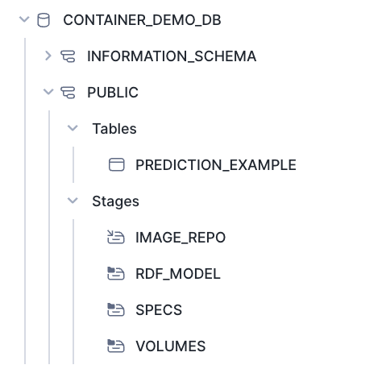

# DataScience Development Template Example


<!-- WARNING: THIS FILE WAS AUTOGENERATED! DO NOT EDIT! -->

> **WARNING**: This is just for development this has not been approved
> by security or infosec to be deployed so if you are going to deploy
> this please understand there are risks and that this has not been full
> secured please review with your data goverance teams to make sure this
> is safe to deploy.

##### **REMEMBER TO OPEN JUPYTER AND NAGVIATE TO NBS/index.ipynb and run the commands in the notebook this will allow everything to work seamlessly**

## Create Local Conda Environment

> **Warning**: You must have conda installed on your computer already
> before you are able to work through this process.

You will use this to run your streamlit app locally with streamlit and
your env variables this is more for the developer that wants to make
quick changes with streamlit before wanting to test the build

``` python
! conda create --name snowpark2 --override-channels -c https://repo.anaconda.com/pkgs/snowflake python=3.10 --y; conda activate snowpark2; pip install -r ../infra/requirements.txt
```

Once installed you will want to switch your kernerl to snowpark2 so you
might need to close jupyter and re-open to get into the correct
enviornment.

## Creating a Symlink

``` python
# Create Symlink for Notebook
! ln -s ../DataScience/ ./DataScience
```

## Load Libraries Needed

``` python
from DataScience.connection import *

import os
import pandas as pd
```

## Create Local Authorization Json

> If you don’t have your enviornment variables ready then you can go
> ahead and create a demo_auth.json you will need to put
> `load_credentials('demo_auth.json')` in the create_snowflake_session()

``` python
# write_to_json('myUsername', 'myPassword', 'myAccount', 'demo_auth.json')
```

``` python
# !ls | grep demo_auth
```

## Create Session and Execute Set Up

``` python
session = create_snowflake_session()
```

``` python
execute_sql_file(
    session,
    file_path='DataScience/files/sql/00_setup.sql'
)
```


We want to make sure out image repository was created so we will run the
following command

``` python
# Removing 'repository_url' column from output to secure the URL link
display(pd.DataFrame(session.sql(f"SHOW IMAGE REPOSITORIES;").collect())[['created_on', 'name', 'database_name', 'schema_name', 'owner', 'owner_role_type', 'comment', 'repository_url']])
pd.DataFrame(session.sql(f"SHOW IMAGE REPOSITORIES;").collect())[['repository_url']].values[0][0]
```

<div>

<div>
<style scoped>
    .dataframe tbody tr th:only-of-type {
        vertical-align: middle;
    }
&#10;    .dataframe tbody tr th {
        vertical-align: top;
    }
&#10;    .dataframe thead th {
        text-align: right;
    }
</style>

|     | created_on                       | name       | database_name     | schema_name | owner               | owner_role_type | comment                     | repository_url                                    |
|-----|----------------------------------|------------|-------------------|-------------|---------------------|-----------------|-----------------------------|---------------------------------------------------|
| 0   | 2024-03-22 09:25:57.664000-07:00 | IMAGE_REPO | CONTAINER_DEMO_DB | PUBLIC      | CONTAINER_USER_ROLE | ROLE            | This is for modeling useage | sfsenorthamerica-demo-jdemlow.registry.snowfla... |

</div>

</div>

    'sfsenorthamerica-demo-jdemlow.registry.snowflakecomputing.com/container_demo_db/public/image_repo'

^^string above is going to be your repository that you will put into the
cells below to make your make file.

## Configure Yaml Files

> **Warning**: Set up config.toml with snow sql need to be set up before
> running configure.sh and ensure Docker is on your computer

``` python
# The last output of this will be the url you put here
! rm ../modeling.yaml
! rm ../Makefile
! bash ../infra/configure.sh -r "sfsenorthamerica-demo-jdemlow.registry.snowflakecomputing.com/container_demo_db/public/image_repo" -w "CONTAINER_DEMO_WH" -i "modeling"
```

``` python
! cat ../modeling.yaml
```

#### Move Newly Created Spec File (streamlit.yaml) to Stage @specs

``` python
stage_location = r'@specs'
stage_location = stage_location.strip('@')
file_path = '../modeling.yaml'

put_results = session.file.put(local_file_name=file_path, stage_location=stage_location, auto_compress=False, overwrite=True)
for result in put_results:
    print(f"File: {result.source}, Status: {result.status}")
display(pd.DataFrame(session.sql('ls @specs').collect()))
```

    File: modeling.yaml, Status: UPLOADED

<div>

<div>
<style scoped>
    .dataframe tbody tr th:only-of-type {
        vertical-align: middle;
    }
&#10;    .dataframe tbody tr th {
        vertical-align: top;
    }
&#10;    .dataframe thead th {
        text-align: right;
    }
</style>

|     | name                | size | md5                              | last_modified                 |
|-----|---------------------|------|----------------------------------|-------------------------------|
| 0   | specs/modeling.yaml | 530  | a3d1e68a091ea60647950495bd022360 | Fri, 22 Mar 2024 18:44:44 GMT |

</div>

</div>

#### Login Into Snowflake Image Repo and Push Docker Image

#### Run Locally Ensure

You need to test this locally designed to allow you to have a better
understanding `make build_local; make run` and make sure it’s working as
you would expect it then move on to the next steps. 1. Download docker
desktop and ensure it is open and running. - \> **Warning**: Make sure
you have docker running and make sure you have logged in already
`~/.docker/config.json` you can check this or run docker login in the
terminal - \> **Also make sure you make your .env file in infra** for
your enviornment vairiables to be used in your docker-compose.yaml. As
you grow out of this tutorial mode the next step here would be to create
github actions to create these approaches so that you are able to run
this in a more devops style approach. In future versions this will be
shown. 2. Open Terminal navigate to this repo and run
`make build_local` - If you are using VS code you can simple click
terminal and paste the command 3. After your local build is complete you
can then run `make run`. - This is going to be running a docker compose
process that can be viewed inside of the infra/ folder

#### Pictures of Steps


> **Note**: As SPCS will not allow your volumes to be respected in a two
> way methodology we have observed that COPY statements in your
> dockerfile which land in a directory which are then stage-mounted as a
> volume will NOT initialize the file in-stage. We have on open product
> gap for this but has thus far been low-priority currently so we are
> going to bring this repo to our development experience using the
> github, gitlab, bitbucket etc integrations later on in this process.
> So if you are wondering why we are using gh cli to bring the repo to
> the docker image this is one of the reasons.

> You also need to make sure you are able to login in with snowql and
> snow cli to be able to run the following commands

#### Login, Create, Push To Snowflake

``` python
! cd ../ &&  make all
```

> [!NOTE]
>
> ### Explain Make File Call
>
> The `make all` command in the context of a Makefile is a target that
> typically encompasses a series of dependent tasks required to build a
> project. It’s designed to automate the process of compiling, building,
> and preparing a software application or service. Here’s a step-by-step
> explanation of what `make all` does in the provided Makefile script:
>
> 1.  **`login:`** This target logs into the Snowflake Docker
>     repository. It’s the initial step to ensure that subsequent
>     operations, such as pushing a Docker image, can authenticate
>     against the Snowflake registry. The `docker login` command uses
>     the `$(SNOWFLAKE_REPO)` variable, which should contain the URL of
>     the Snowflake Docker repository.
>
> 2.  **`build:`** This target builds a Docker image for Snowpark
>     Container Services. It specifies the platform as `linux/amd64`,
>     uses a Dockerfile located in the `infra` directory, and tags the
>     resulting image with the name specified in the `$(DOCKER_IMAGE)`
>     variable. This step prepares the Docker image with the necessary
>     environment and dependencies for the application.
>
> 3.  **`push_docker:`** After the Docker image is built, this target
>     tags and pushes it to the Snowflake Container Services repository
>     specified in the `$(SNOWFLAKE_REPO)` variable. This makes the
>     Docker image available in Snowflake’s registry, allowing it to be
>     used in Snowflake Container Services.
>
> In summary, `make all` in this script is a composite command that
> automates the workflow of logging into the Snowflake Docker
> repository, building a Docker image tailored for Snowpark Container
> Services, and pushing the built image to the Snowflake repository.
> This streamlines the deployment process, ensuring that the Docker
> image is readily available in Snowflake for running services or
> applications.

``` python
execute_sql_file(
    session,
    file_path='DataScience/files/sql/01_container_services.sql'
)
```

> [!NOTE]
>
> ### Explain Container Services Execution Code
>
> # Snowflake Configuration for Some Enhanced Security and Services
>
> ## Step 1: Create Security Integration for OAuth
>
> Sets up an OAuth security integration for authentication purposes.
>
> ``` sql
> USE ROLE ACCOUNTADMIN;
> CREATE SECURITY INTEGRATION IF NOT EXISTS snowservices_ingress_oauth
>   TYPE=oauth
>   OAUTH_CLIENT=snowservices_ingress
>   ENABLED=true;
> ```
>
> ## Step 2: Configure Network Rules and External Access
>
> Defines a network rule to allow all outbound traffic on ports 443 and
> 80, and creates an external access integration to permit this traffic.
>
> ``` sql
> CREATE OR REPLACE NETWORK RULE ALLOW_ALL_RULE
>   TYPE = 'HOST_PORT'
>   MODE = 'EGRESS'
>   VALUE_LIST= ('0.0.0.0:443', '0.0.0.0:80');
>
> CREATE OR REPLACE EXTERNAL ACCESS INTEGRATION ALLOW_ALL_EAI
>   ALLOWED_NETWORK_RULES = (ALLOW_ALL_RULE)
>   ENABLED = true;
> ```
>
> ## Step 3: Grant Usage on Integrations
>
> Grants the `CONTAINER_USER_ROLE` usage permission on the external
> access integration.
>
> ``` sql
> GRANT USAGE ON INTEGRATION ALLOW_ALL_EAI TO ROLE CONTAINER_USER_ROLE;
> ```
>
> ## Step 4: Create Compute Pool
>
> Establishes a compute pool with specified node limits and instance
> family for processing.
>
> ``` sql
> CREATE COMPUTE POOL IF NOT EXISTS CONTAINER_DEMO_POOL
>   MIN_NODES = 1
>   MAX_NODES = 1
>   INSTANCE_FAMILY = standard_1;
> GRANT USAGE ON COMPUTE POOL CONTAINER_DEMO_POOL TO ROLE CONTAINER_USER_ROLE;
> ```
>
> ## Step 5: Create Streamlit Snowpark Service
>
> Creates a Streamlit Snowpark service using the compute pool and
> specifies external access integrations for it.
>
> ``` sql
> USE ROLE CONTAINER_USER_ROLE;
> CREATE SERVICE CONTAINER_DEMO_DB.PUBLIC.STREAMLIT_SNOWPARK_SERVICE
> in compute pool CONTAINER_DEMO_POOL
> from @specs
> specification_file='streamlit.yaml'
> external_access_integrations = (ALLOW_ALL_EAI)
> MIN_INSTANCES=1
> MAX_INSTANCES=1;
> ```
>
> ## Step 6: User Creation and Role Assignment
>
> Creates a user with specified credentials, default role, and
> warehouse. Grants the user and the role usage permissions on various
> resources.
>
> ``` sql
> USE ROLE ACCOUNTADMIN;
> CREATE OR REPLACE USER RANDOMEMPLOYEE
> IDENTIFIED BY 'Snowflake2024'
> DEFAULT_ROLE = 'CONTAINER_USER_ROLE'
> DEFAULT_WAREHOUSE = 'CONTAINER_DEMO_WH';
> GRANT ROLE CONTAINER_USER_ROLE TO USER RANDOMEMPLOYEE;
> GRANT USAGE ON WAREHOUSE CONTAINER_DEMO_WH TO ROLE CONTAINER_USER_ROLE;
> GRANT USAGE ON SERVICE STREAMLIT_SNOWPARK_SERVICE TO ROLE CONTAINER_USER_ROLE;
> ```

## Looking Into Service Created

``` python
session.sql("SHOW SERVICES;").show()
```

    ------------------------------------------------------------------------------------------------------------------------------------------------------------------------------------------------------------------------------------------------------------------------------------------------------------------------------------------------------------------------------------------------
    |"name"                     |"database_name"    |"schema_name"  |"owner"              |"compute_pool"       |"dns_name"                                          |"min_instances"  |"max_instances"  |"auto_resume"  |"external_access_integrations"  |"created_on"                      |"updated_on"                      |"resumed_on"  |"comment"  |"owner_role_type"  |"query_warehouse"  |
    ------------------------------------------------------------------------------------------------------------------------------------------------------------------------------------------------------------------------------------------------------------------------------------------------------------------------------------------------------------------------------------------------
    |MODELING_SNOWPARK_SERVICE  |CONTAINER_DEMO_DB  |PUBLIC         |CONTAINER_USER_ROLE  |CONTAINER_DEMO_POOL  |modeling-snowpark-service.public.container-demo...  |1                |1                |true           |["ALLOW_ALL_EAI"]               |2024-03-22 11:51:08.455000-07:00  |2024-03-22 11:51:10.110000-07:00  |NULL          |NULL       |ROLE               |NULL               |
    ------------------------------------------------------------------------------------------------------------------------------------------------------------------------------------------------------------------------------------------------------------------------------------------------------------------------------------------------------------------------------------------------

**Remember**: That this will take a few minutes of your service to be up
and running so you will be able run the following command again and it
will give you the url link that will allow you to log into your app with
the correct Username and Password.

> `CALL SYSTEM$GET_SERVICE_STATUS('CONTAINER_DEMO_DB.PUBLIC.MODELING_SNOWPARK_SERVICE');`
> You can also try this command to see the status of your service you
> might get an ingress_url before the pending state is resolved.

``` python
temp = pd.DataFrame(session.sql("SHOW ENDPOINTS IN SERVICE MODELING_SNOWPARK_SERVICE;").collect())
display(temp)
print(temp["ingress_url"].values[0])
```

<div>

<div>
<style scoped>
    .dataframe tbody tr th:only-of-type {
        vertical-align: middle;
    }
&#10;    .dataframe tbody tr th {
        vertical-align: top;
    }
&#10;    .dataframe thead th {
        text-align: right;
    }
</style>

|     | name     | port | protocol | ingress_enabled | ingress_url                                       |
|-----|----------|------|----------|-----------------|---------------------------------------------------|
| 0   | modeling | 8080 | HTTP     | true            | bg54b6i-sfsenorthamerica-demo-jdemlow.snowflak... |

</div>

</div>

    bg54b6i-sfsenorthamerica-demo-jdemlow.snowflakecomputing.app

Assuming ingest_url contains the URL you want to copy and paste this URL
into your browser and enjoy your modeling jupyter notebook.

1.  Open in web broswer and paste the ingress_url
2.  This will open a login page for this demo it is
    - Usename: RandomEmployee
    - Password: Snowflake2024
3.  Streamlit App Will Load and Your Application is ready to go

# Snowflake App Deployed

Now that we have the docker image deployed and in a ready state we are
now ready to go in and see what we have created.




# Clean Up

``` python
execute_sql_file(
    session,
    file_path='DataScience/files/sql/03_teardown.sql'
)
```

# Conclusion

This was just as simple example of the power of creating modeling
application with in snowflake in a fast an secure fashion that you are
able to share with your teams across your organizations please make sure
you come back for more examples like this as we will begin to build more
and more use cases inside of the SPCS as this is going to be a powerful
building block to unlock the full potential of snowflake as a platform.

``` python
gh auth login
git config --global user.name "sfc-gsfc-gh-jdemlow"
git config --global credential.helper cacheche
```
